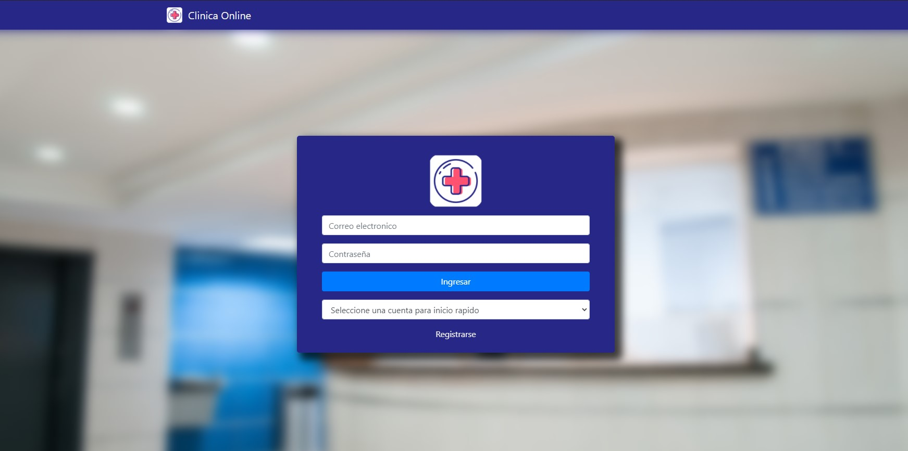
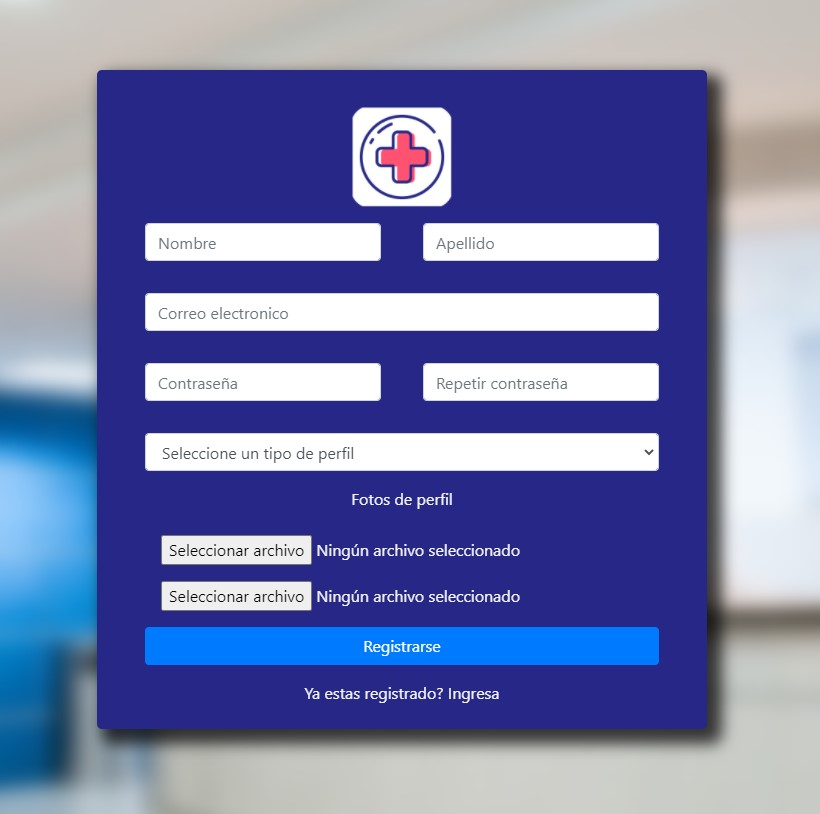

# ClinicaOnline

“La clínica OnLine, especialista en salud, cuenta
actualmente con consultorios (6 en la actualidad),
dos laboratorios (físicos en la clínica), y una sala
de espera general. Está abierta al público de lunes
a viernes en el horario de 8:00 a 19:00, y los
sábados en el horario de 8:00 a 14:00.

## Guia de uso

## Perfiles

### Administrador

El administrador esta a cargo de habilitar a los profesionales para poder atender en la clinica y puede dar de alta otros administradores.

### Paciente

El paciente utiliza la plataforma para poder pedir turnos y manejo de sus propios turnos.

### Profesional

Los profesionales son quienes estan a cargo de atender a los pacientes. En esta plataforma pueden administrar los turnos de manera ordenada, teniendo acceso a turnos pendientes y un historial de turnos. Este tambien puede elegir los horarios en los que va a trabajar.

## Guia de uso

### Login

El usuario inicia sesion con su correo electronico y contraseña.

### Registro

Un usuario nuevo puede registrarse eligiendo su perfil, puede ser profesional o paciente.

#### Registro Profesional

Formulario de registro Doctor:

#### Correo de verificacion

Una vez registrado, se envia un correo de verificacion a la casilla seleccionada. El usuario debe verificarse si o si para poder ingresar a la plataforma.

### Paciente

#### Sacar Turno

El paciente puede elegir la especialidad, el medico de la especialidad seleccionada y uno de los turnos disponibles

#### Proximos Turnos

El paciente puede ver sus proximos turnos y en que estado se encuentran.

### Profesional

#### Turnos pendientes

El profesional acepta o rechaza los turnos pendientes de aprobacion

#### Atender Turnos

El profesional atiende a un paciente dejando una reseña del mismo

#### Historial Turnos

El profesional puede ver un historial de sus ultimos turnos

##### Horarios

El profesional puede elegir sus horarios de trabajo

### Administrador

##### Habilitar profesionales

El administrador puede habilitar profesionales para que puedan atender en la clinica

##### Carga de administradores

El administrador es el unico que puede dar de alta otro administrador

